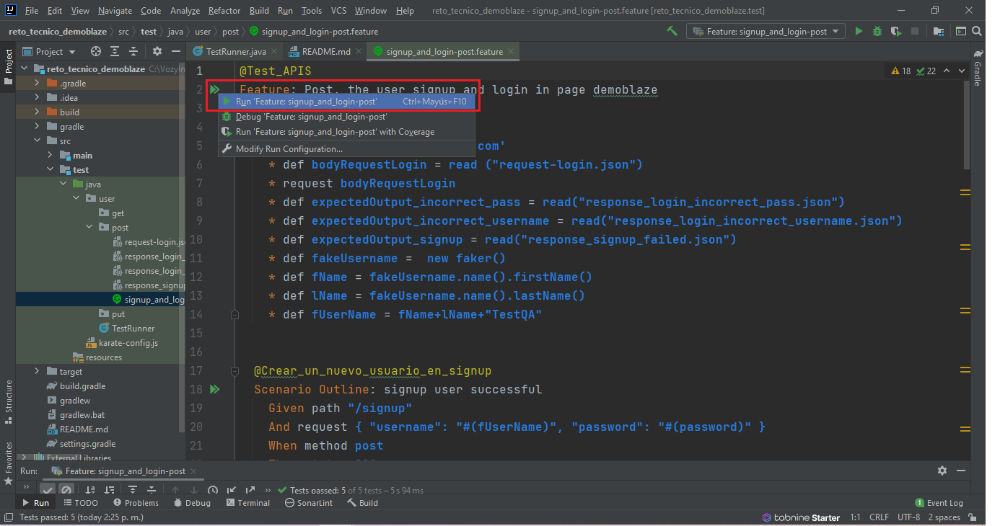
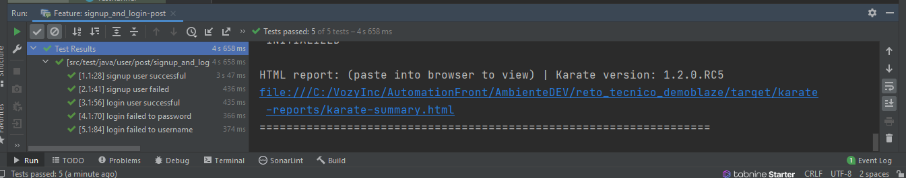
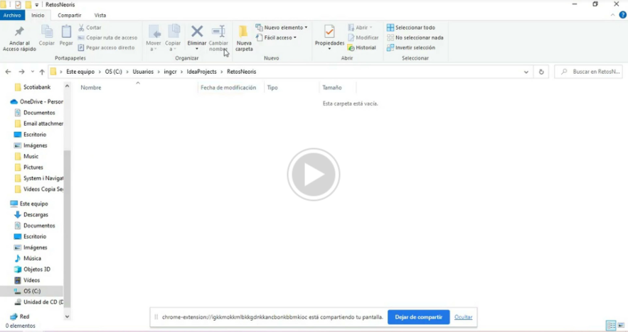

# RetoAutomationQA-Neoris -APIs
#**Test Automation - Karate frameworks - API**

## Pre-requisitos
1. Java 8
2. Gradle 5.2.1 o Superior
3. IDE de desarrollo
	- a) Eclipse
	- b) IntelliJ

## Descripción

Este proyecto es un reto de automatización API, se encuentra creado bajo frameworks Karate y el manejador de proyecto Gradle.


Este proyecto cuenta con la ejecución de los siguientes test cases:

##Escenario:

    Signup: https://api.demoblaze.com/signup Login: https://api.demoblaze.com/login Identificar las entradas y capturar las salidas en cada uno de los siguientes casos:    
    
    • Crear un nuevo usuario en signup
	• Intentar crear un usuario ya existente
	• Usuario y password correcto en login
	• Usuario y password incorrecto en login


- **saucedemo.feature**: En este feature se realiza la ejecución de un escenario donde se verifica las APIs Signup y login. Teniendo en cuenta el camino feliz y el camino fallido.

---
  
---
## Instalación

Para instalar el proyecto deben seguir los siguientes pasos:

**1. Clonar el proyecto desde una terminal git**

```
git clone https://github.com/CristianHdezZ/reto_tecnico_demoblaze-Neoris.git
```

**2. Abrir el proyecto**

Para abrir el proyecto debe hacerlo desde el IDE de su preferencia seleccionando la carpeta **"reto_tecnico_demoblaze"** como un proyecto Gradle.


**3. Ejecutar el proyecto**

Para ejecutar el proyecto debe hacerlo a través de uno de los siguientes pasos:

**3.1 A través de IDE**

Si se desea realizar la ejecución a través del IDE de desarrollo, se debe seleccionar la clase **"SaucedemoRunner.class"** y dar clic derecho, seleccionar la opción que permita correr la prueba:

```
1. Ubicarse en el archivo "signup_and_login-post.feature"
2. Dar click en las fechas verdes   
3. Dar click en en Run 'Feature:signup_and_login-post'
```



## Video de configuracion y ejecución:

[](https://drive.google.com/file/d/1CgWfoLqRbgE7bk21JMrlCzGYBN8w8Oro/view?usp=sharing)


---
## ️Autores
* **Cristian Hernandez Z.**  - [CristianHdezZ](https://github.com/CristianHdezZ/)
---

